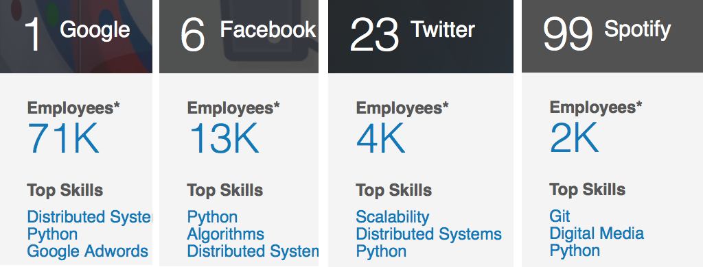

## Python 2014
Andy McKay

andy@clearwind.ca

@andymckay

http://andymckay.github.io/presentations/


## What is Python?
"Python is a widely used general-purpose, high-level programming language. Its design philosophy emphasizes code readability."

"Python 1.0 - January 1994"


## Whitespace
Yeah baby!

```python
class Hello(object):

    def world(self):
       print 'hello world'

hello = Hello()
hello.world()
```


## REPL
```python
 ~ $ python3
Python 3.3.0 (default, Apr 17 2013, 20:05:19)
[GCC 4.2.1 Compatible Apple Clang 4.1 ((tags/Apple/clang-421.11.66))] on darwin
Type "help", "copyright", "credits" or "license" for more information.
>>> x = [4, 6, 2, 1]
>>> sorted(x)
[1, 2, 4, 6]
>>> sum(sorted(x))
13
```


## State of things
Pretty good

Large community

Lots of users

Big conferences


## Jobs




## Python 2
Python 2.7

Currently the most popular Python release.


## Python 3
Some incompatibilities

Released 5 years ago

Currently on 3.4.0 beta 2


## Async I/O
We've had twisted, gevent and so on for a while

Added in "State of the art asynchronous I/O for Python"

Addition of **yield from**

https://www.dropbox.com/s/essjj4qmmtrhys4/SFMeetup2013.pdf

http://docs.python.org/3.4/library/asyncio.html?highlight=asyncio#module-asyncio


## Speed
pypy

"PyPy is a fast, compliant alternative implementation of the Python language"

http://pypy.org/


## Upgrading
Still an issue

Majority of users are on Python 2x

eg. RHEL on 2.6

Which should I choose? Start with Python 3, but if libraries are a problem, go down to Python 2.


## Strength of Python
There are libraries for **almost anything**

The code will be pretty readable


## Web Frameworks (1)
** Django **

Full featured, easy to get into

Instagram, Pinterest, Mozilla, Disqus, Bitbucket

http://djangoproject.com


## Web Frameworks (2)
**Flask**

http://flask.pocoo.org

**Pyramid**

http://www.pylonsproject.org/


## CMS
Web based CMS tend to follow web framework trends

**Plone**

http://plone.org/

**Django CMS**

https://www.django-cms.org/en/


## Sys. Admin Tools (1)
**Fabric**

"designed to use SSH to execute system administration and deployment tasks on one or more remote machines"

http://docs.fabfile.org/en/1.8/


## Sys. Admin Tools (2)
**Salt Stack**

Alternative to puppet

http://www.saltstack.com/community/#!


## Cloud Tools
**Open Stack**

"The Open Source Cloud Operating System"

http://www.openstack.org/


## Cloud Libraries
**libcloud**

"Apache Libcloud is a standard Python library that abstracts away differences among multiple cloud provider APIs"

http://libcloud.apache.org/


## Raspberry Pi (1)


"The Raspberry Pi is a credit-card sized computer that plugs into your TV and a keyboard."


## Raspberry Pi (2)

"the 2,000,000th Raspberry Pi was sold in the last week of October"

Comes with Python, IDLE out of the box.

http://www.raspberrypi.org/


## Community


PyCon 2014 US is in Montréal

https://us.pycon.org/2014/


## Vancouver Python User Group

Meetup a few times a year

http://www.meetup.com/vanpyz/

150+ at a recent Vancouver Python Day


## Questions
@andymckay

http://andymckay.github.io/presentations/
